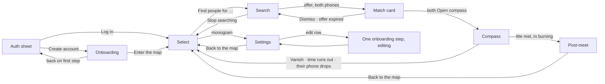
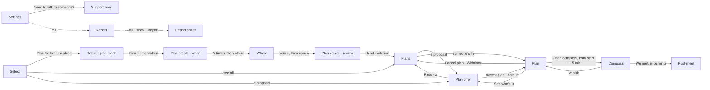
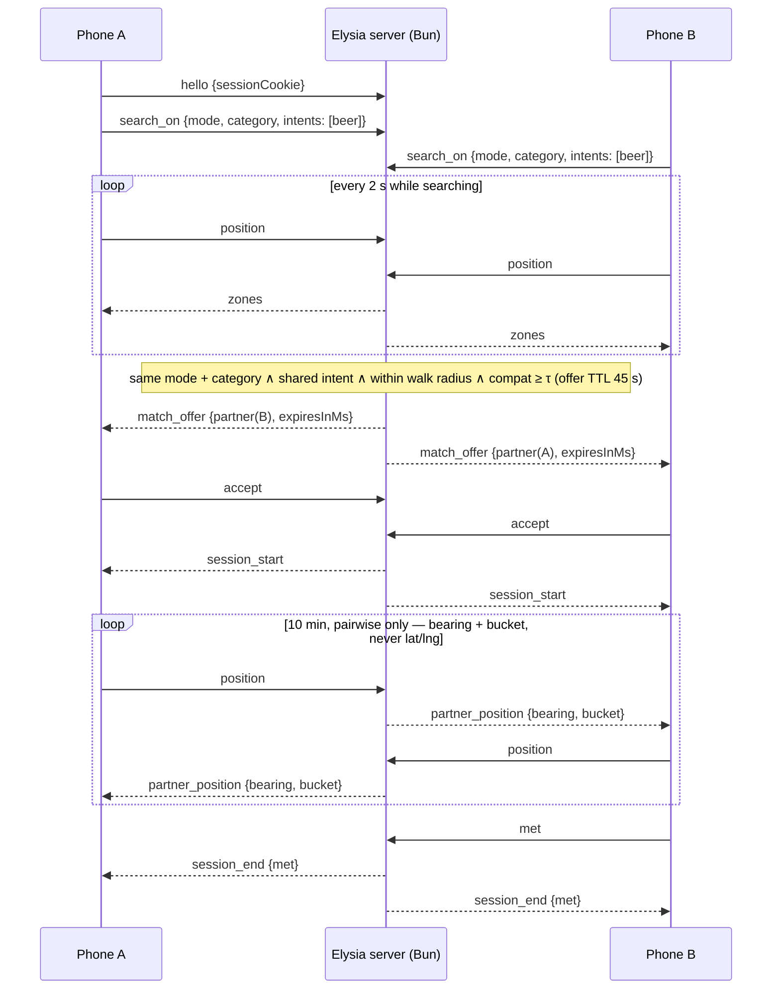

# JustMate — app structure (screens · use cases · flows)

The source of truth for the mobile app's screens, flows, states and copy. It follows the app prototype in the **JustMate Design System** project in Claude Design (https://claude.ai/design/p/c59ab891-429e-48c6-8f77-d899971225cc); where an older note disagrees, the prototype wins. Product rationale lives in `PRODUCT.md`, pitch copy in `DEMO.md`. **Visual, motion and interaction rules (colours, type, materials, springs, haptics, accessibility, the morph surface, the badge) live in `DESIGN.md`**; tokens referenced below in `code` come from there. The wire contract is `PROTOCOL.md`; what the design needs that the wire doesn't carry yet is listed at the end ("Protocol gaps").

Layout north star: **Bolt**. The map is fullscreen, one surface sits on top of it, and there's one primary action. Feel north star: **Apple fluid interfaces**. Press feedback is instant, springs are interruptible, and the chrome over the map is translucent. Bolt's "pick a destination, see supply heat, order" becomes "pick what you're up for, see where compatible people are, find people".

**Added after the mentor review (Sat 3 Oct):** Plans, the help row and the safety screens are in their own section, "Plans, safety and help", just before "Use cases", so the changes stay visible in one place.

## One surface, eight shapes

The app is a single continuous surface over the map that morphs between shapes (`DESIGN.md` §13.1). Screens below are shapes of that surface, not stacked pages.

| Shape | Geometry · tone | What it holds |
|---|---|---|
| `auth` | floating sheet · paper | log in / create account |
| `onboard` | full screen · page | the profile flow |
| `select` | floating sheet · paper | headline, category bento, **Find people for …** |
| `search` | floating sheet · paper | what you're looking for, the clock, **Stop searching** |
| `match` | card from the top · ink | their vibe badge, **Open compass** / **Dismiss** |
| `compass` | full screen · night | countdown, arrow, bucket, **Vanish** / **We met** |
| `postmeet` | full screen · night | both badges, their name, distance walked, **Same again next week?** |
| `settings` | full screen · page | profile, map, feel, privacy, account |

## Screen map

- The app opens on the last persisted shape among `auth`, `onboard`, `select`, `settings`. First launch opens on `auth`.
- **Log in** goes straight to the map. It opens in the mode set in Settings ("Open the map in"), else the profile's mode.
- **Create account** grows the sheet into onboarding with a fresh profile. Back on the first step returns to auth, register tab.
- Onboarding done → select, with the Date / Mate tab set to the profile's mode.

## Modes: Date and Mate

Every profile has a mode, and the map can switch between them at any time.

- **Date** (`heart`, tag "love"): "Someone to fall for, a few streets away."
- **Mate** (`users`, tag "friends"): "People to grab a beer or a game with, right now."

The mode decides the onboarding flow, the interest list, the profile questions, the categories on the map and the pronoun on a match. In date mode the match is "her" when you're interested in women, "his" for men, otherwise "their". In mate mode it's always "their".

## Screens

### 0. Auth (sheet over the map)

Above the sheet, on the map: the wordmark **just-mate**, "Meet for real.", and mono "no faces · no chat · no pins".

- `Segmented`: **Log in** / **Create account**.
- Fields: `email` ("you@example.com") and `password` ("6 characters or more"). The button stays disabled until the email looks valid and the password has 6+ characters.
- Button: **Log in**, or **Create account** with a trailing arrow.
- Under it: ghost **Forgot password** (log in), or the footnote "Next: a faceless profile. Two minutes, no photos of you shown to anyone." (create account).
- The reset email's link (`justmate://reset-password?token=…`) opens the same sheet as "Pick a new password" · "6 characters or more. Your other devices get signed out.", field `new password`, **Save password** → "Password saved. Log in with it." + **Log in**. An expired link reads "this link has expired. ask for a new one from log in."

### 1. Onboarding (full page, once; single steps reopen from Settings)

Purpose: build the faceless profile and teach the three rules before the map.

| Mode | Flow |
|---|---|
| Date | mode → name → interests → questions → who → swipe → verify |
| Mate | mode → name → interests → questions → who → schedule → verify |

Header: ghost back arrow, `StepDots` for the whole flow (mono "editing" when a single step is reopened from Settings). Each step has a mono eyebrow `<group> · n of m`. The groups are `welcome` (mode), `about you` (name, interests, questions), `who you're after` (who, swipe or schedule) and `last step` (verify). Steps slide in 28 pt in the direction of travel.

| Step | Title · sub | Content | CTA |
|---|---|---|---|
| **mode** | "What are you here for?" · "Pick one to start. You can switch on the map any time." | two mode cards: **Date** · **Mate** | **Start with you** → |
| **name** | "What should we call you?" · "First name only. A match sees it once you've met." | field `first name` ("e.g. Alex"); "I am": woman / man / non-binary | **Call me {name}** · disabled "Type your name" |
| **interests** | date "What are you into?" · mate "What do you like doing?" · "Pick at least 3. Each pick opens related ones." | interest chips; each pick reveals 3 related chips (with a loading pill while they arrive) | **That's me** · disabled "Pick {n} more" |
| **questions** | 4 questions, written live from the previous answers | 4 option chips + field "or in your own words" ("say it your way"); see below | **Next question** · last: **Write my vibe** |
| **your badge** | eyebrow "about you · your vibe" · "Designed from your picks. All a match sees." | lanyard vibe badge; caption "Colours from {3 interests}. Pattern from your {n} answers."; tertiary **Reroll** | **Keep this vibe** |
| **who** (date) | "Who are you looking for?" · "Used for matching only. Nobody sees your settings." | interested in: women / men / everyone · age 18–60+ · looking for: something real / see where it goes / something light | **Train my taste** |
| **who** (mate) | "Who's your kind of mate?" · "Matching uses this. It stays on your side." | who: anyone / same gender · group: one-on-one / small group · energy: chill / either / active · age | **Sounds right** |
| **swipe** (date) | "Who catches your eye?" · "Swipe sample photos, never real people. Only the traits you're into are kept, never a photo." | 6 sample cards (a sample photo with its description, or placeholder "sample photo 01" with a traits line like "tall · dark hair · beard"; thinking line "loading sample photos…" first), mono "n of 6 · a sample, not a user"; stamps "into it" / "not for me"; x and heart buttons with "n / 6"; done card "Taste saved" · "{n} into it · {m} not for me" | **Verify me** (loading while the traits are written) · disabled "{n} left to swipe" |
| **schedule** (mate) | "When are you usually around?" · "Pick any. It helps us time your matches." | weekday mornings · lunch breaks · after work · late nights · weekends; "a hangout usually lasts": an hour / a few hours / all day | **Verify me** · disabled "Pick at least one" |
| **verify** | date "Prove you're real, and 18+" · mate "Prove you're real" · "One selfie, checked once, then deleted. Nobody ever sees it." | ink selfie panel with oval guide and progress ring; status "center your face in the oval" → "hold still…" → "real person · photo deleted". Date adds the check row **"I'm 18 or older"** ("Required for dating. Checked against your selfie."). Footer mono "liveness check simulated in this build" | **Take selfie** (loading while scanning) → **Enter the map** (date: only once 18+ is checked) |

**Interests**:

- Date: coffee · wine · cinema · books · travel · cooking · hiking · techno · jazz · art · dogs · yoga · photography · street food.
- Mate: board games · climbing · running · gym · football · padel · gaming · pub quiz · hiking · cycling · concerts · cooking · coding · chess.

Each interest has 3 related ones (coffee → flat white · café hopping · specialty roasters).

**Questions**:

- Eyebrow "about you · question n of 4". The caption (with sparkles) reads "Written from your last answer", "Written from {interest} and {interest}", or "Sample question · live questions off".
- A mono trail "so far a · b · c" collects the answers. While the next question is being written, a thinking line shows "getting a feel for you…" / "reading your answers…".
- Rules for generated questions: sentence case, under 60 characters, 4 options under 26 characters each, lowercase options, no emoji, no exclamation marks, never repeat a topic.
- Fallbacks, date:
  - "Perfect first hour with someone new?" (a long walk, no plan · bar stools and bad jokes · a gallery we pretend to get · cooking something messy)
  - "What makes you lose track of time?" (a good argument · a record shop · people-watching · a project at 2am)
  - "Which small thing wins you over?" (remembering details · laughing at themselves · great taste in music · being on time)
  - "Your friends would call you…" (the planner · the instigator · the calm one · the storyteller)
- Fallbacks, mate:
  - "Nothing planned tonight. What's the move?" (grab a pint · find a pickup game · wander somewhere new · board games till late)
  - "In a group you're usually…" (the one with the plan · the joker · the listener · the competitive one)
  - "What would you teach a new mate?" (a card game · a running route · a recipe · a hidden bar)
  - "Pick a deal-breaker." (always late · no banter · phone at the table · sore loser)

**Vibe line**:

- Rules: two short lowercase clauses joined by " — ", wry and specific, 60 characters at most, no names, emoji or quotes.
- Written from the answers. While it's being written the badge reads "writing…".
- Fallbacks: "quietly funny — will out-argue you about pizza" · "early bird with a film camera — opinions on oat milk" · "knows every climbing gym in town — still scared of ladders" · "techno on fridays — crosswords on sundays" · "plans the trip — forgets the charger".

**The badge**:

- Eyebrow "{name} · wants: {first interest}", the vibe line as the quote, and the mode as the tag.
- Its colours, pattern and icon are designed from your picks and answers (`DESIGN.md` §13.5). It is all a match ever sees of you.

**Behind the badge** (never shown to anyone):

- When the badge appears, the server also writes the **character** from the answers: five lines shaped "Trait — concrete detail." (`PROTOCOL.md` › Onboarding helpers). **Keep this vibe** waits for it (fallback: the answers, one per line). It and the vibe feed the dev profile card in `temporary/` (`docs/examples/profile_card.md`), the ML input.

**Swipe and selfie, what is real:**

- The swipe cards are generated sample photos from `GET /taste` (`server/taste/<group>/<n>/`), filtered by "interested in" (everyone alternates women and men); without them the striped placeholders and fixed trait lines stand in. These are never users, so they don't break "no faces": they only train taste. When all 6 are swiped, the descriptions of the ones marked "into it" go to the server, which keeps only the traits they share (`profile.taste`); the photos and the "not for me" picks never leave the phone.
- **Take selfie** opens the front camera (`expo-image-picker`, `CAMERA_COPY` in `app.config.ts`). The photo is held in memory, sent once to the server, which describes only visible hair and face features (`profile.appearance`), and is never stored, logged or shown. Liveness itself is still simulated; without a camera (simulator, access denied) the timed scan alone passes. Cancelling the camera returns to the oval.

### 2. Select: "What are you up for?" (sheet over the map)

**Map and chrome**

- **Map**: pale greyscale base (`mapBg`) with a faint street grid. Own position is the mint `self` dot, the only dot ever drawn. No heat while you're invisible.
- **Top**: `StatusPill` `invisible` on the left. `Monogram` (your initials, 40) on the right opens Settings.
- **Date / Mate** `Segmented` (`heart` / `users`) floats under the pill. Switching it clears the category and picks.

**The sheet**

- **Headline** rotates every 3.2 s and pauses while a category is open:
  - date: "What are you up for?" · "Where to tonight?" · "What's the plan?" · "Try something new?"
  - mate: "What are you up for?" · "Who's in for something?" · "What's the plan?" · "Go do something."
- **Footnote**: date "Meet someone new over something you'd do anyway." · mate "Find company for something you'd do anyway."
- **Category bento**: six tiles. Tapping one opens it into a dark card with its intents as chips plus **other**, under mono "pick any · {n} selected". Its first intent comes pre-picked; any number can be picked. The other tiles fold into an icon strip. `x` closes the card and clears the picks.
- **Footer**: "You're invisible until you pick something." until a category is open, then the primary **Find people for {picks}** (disabled "Pick at least one").
- **Picks label**: one pick "beer", two "beer or coffee", more "beer, coffee +2". **other** reads "something else".

| Date category | Intents |
|---|---|
| Food and drink | coffee · wine · dinner · brunch · beer · dessert · street food · tea |
| Nightlife | cocktails · dancing · karaoke · late bar · rooftop · comedy night · jazz club |
| Outdoors | walk · picnic · sunset · cycling · riverside · stargazing · park bench |
| Culture | cinema · exhibition · theatre · bookshop · museum · poetry night · street art |
| Music | live gig · jazz bar · record shop · open mic · vinyl bar · concert |
| Attractions | funfair · bowling · escape room · mini golf · arcade · zoo · ferris wheel |

| Mate category | Intents |
|---|---|
| Food and drink | beer · coffee · lunch · street food · pizza · brunch · wine · ramen |
| Sports | running · gym · climbing · football · padel · tennis · basketball · yoga · swim |
| Games | board games · pub quiz · chess · arcade · darts · pool · cards · video games |
| Outdoors | hike · cycling · walk · frisbee · skate · kayak · picnic |
| Music | gig · jam session · record shop · open mic · karaoke · festival |
| Culture | cinema · exhibition · workshop · museum · talk · comedy |

Category icons are in `DESIGN.md` §9.

### 3. Search (sheet over the map)

- **Map**: the **heat field** fades in: a soft density field where compatible people are searching for the same thing, never a pin or a dot per person. Tap a warm zone → badge "~{n} compatible around here" for 2.4 s. Aggregate only.
- **Pill**: `searching: {picks}`, with the pulsing amber dot.
- **Sheet**:
  - a black circle with the intent's icon;
  - mono "● searching · {date|mate} · {category}";
  - "Looking for {picks}" in large title;
  - a row of the category's chips to adjust picks (at least one stays);
  - a card "You're visible nearby" · "Both phones ping at once when it's mutual." with the elapsed clock (m:ss);
  - secondary **Stop searching** (x).
- **Stop searching** → select. Settings › "Stop searching after 30 min" (on by default) does it for you.

### 4. Match (ink card from the top, on both phones at once)

The sheet springs up into an ink card at the top; a scrim dims the map; the status bar hides. Buttons only. There's no swipe-to-dismiss, because an accidental swipe would trigger the pair cooldown.

- Their **lanyard vibe badge** hangs from the top. Eyebrow "{her|his|their} vibe · wants: {intent}", their vibe line as the quote, tag "verified · 18+" (date) or "verified" (mate).
- Mono "match · nearby · on foot" and the offer countdown "0:45", counting down.
- Glow **Open compass** (compass icon) · ghost **Dismiss** · footnote "unlocks only if they accept too". No match percentage is shown.
- After **Open compass**, the button becomes a disabled secondary "waiting for them…" in place, and Dismiss disables. When both have accepted, the card grows into the compass.
- **Dismiss** → back to search; another offer can come later.
- Countdown reaches 0, or they dismiss → the card shows "offer expired" and "you're still searching", then returns to search after 2.4 s. It never says "they declined".
- Arrival: vibration `[200,100,200]` + success haptic on the same frame as the card, on both phones, over the live WebSocket. There's no remote push in M0 (`PRODUCT.md` §8).

### 5. Compass (full screen, night)

- **Countdown** from 10:00 at the top, labelled "left · {intent}". It turns `tempHot` at 1:00, with a warning haptic.
- **Arrow** (`CompassDial`): `bearing(me→partner) − magnetometer heading`. Partner position is used *only* for this math and is never rendered on a map. It re-targets with a critically damped spring on every heading sample, taking the shortest angle with no overshoot. While waiting for signal it dims to 40% and the label reads "finding signal…".
- **Distance bucket** (deliberately imprecise): `cold` over 200 m · `warm` under 200 m · `hot` under 80 m · `burning` under 30 m. Colour + word + haptic escalation (heartbeat 3 s → 1.5 s → 0.7 s). Never colour alone.
- **Vibe card**, compact: "you're looking for" + their line.
- **Vanish** (danger, x): always visible, bottom-left, one tap, no confirmation. It ends the session for both and returns to select.
- **We met** (hand): disabled until the bucket is `burning`, then the glow button → post-meet. Either side's tap ends the session for both.
- States: `waiting-for-signal` · `active` · `expired` · `vanished` · `disconnected` (their socket closed; never shown as "vanished").
- Every end (`session_end`) also ends the search for both: select comes back invisible, and finding people again sends a fresh `search_on`. The select footer swaps "You're invisible until you pick something." for one calm line until the next pick: vanished "The compass closed. You're invisible again." · expired "Time ran out. You're invisible again." · disconnected "The signal dropped. You're invisible again." · auto-stop "Stopped after 30 min. You're invisible again."

### 6. Post-meet (full screen, night)

- Two small badges side by side: yours with your first name, theirs with theirs.
- Mono "you found each other" (success) · **"Say hi to {name}."** (their first name from `session_end{met}`) · "You found each other. The rest is up to you."
- Footprints line "You walked {m} m to say hi.", the walked distance rounded, measured on this phone.
- Secondary **Same again next week?** (`calendar-plus`) → "Glad it clicked." Local only; scheduling the repeat is the production path.
- Ghost **Report** → "Reports reach our team in the next version. Feeling unsafe? Call 112." Local notice only (§12 is the production path).
- Primary **Back to the map** → select.

### 7. Settings (full page, from the monogram)

Back arrow "Back to the map" · large title "Settings".

- **Profile card**: badge swatch, name, mono "{mode} · verified|not verified · no. {serial}", vibe line in italics.

| Group | Rows |
|---|---|
| your profile | Name · Interests ("a, b +n") · Questions and vibe ("{n} answers") · Who you're after (date "{seek} · {min}–{max}", mate "{anyone\|same gender} · {one-on-one\|small group}") · date: Appearance taste ("never shown") / mate: When you're around |
| the map | Open the map in: Date / Mate · Walk up to: 5 min / 10 min / 15 min · Stop searching after 30 min (switch) |
| feel | Haptics · Sounds · Reduce motion (switches) |
| privacy and safety | Taste and photos ("never stored") · Blocked people ("0") · Download my data |
| account | Email · Log out |

- Footer: ghost **Delete account** · mono "just-mate · prototype · production path simulated".
- Profile rows reopen their single onboarding step in "editing" mode; done returns to Settings.
- Defaults: haptics on · sounds off · reduce motion off · auto-stop on · walk up to 10 min · open the map in the profile's mode.

## Plans, safety and help (added after the mentor review, Sat 3 Oct)

The mentors asked three things: how JustMate gets a lonely person out of the door, how it protects women from stalkers, and how it pays for itself. The product answer is in `PRODUCT.md` §3.1, §5, §10 and §16. This section lists everything the app gains for it, in one place; the shapes and screens above stay as they are unless a row below says "changed".

Stage tags: **M0** = built for HackYeah · **M1** = production path, design only. In the build, an M1 item is either absent or labelled "production path".

New glyphs (Lucide; add to `DESIGN.md` §9 before use): `calendar-plus` Plan for later · `calendar-check` confirmed · `map-pin` venue · `send` Send invitation · `clock` when · `timer` open until · `eye-off` they see · `pencil` edit · `shuffle` same times · `sparkles` See who's in · `star` rating · `life-buoy` Need to talk to someone? · `ban` Block · `flag` Report · `history` Recent.

### New and changed shapes

| Shape | Geometry · tone | What it holds | Stage |
|---|---|---|---|
| `select` (changed) | floating sheet · paper | + **your plans**, **Plan for later**, **places for you** under the bento; plan mode | M0 |
| `plans` (new) | full screen · page | proposed for you · upcoming · your invitations, **New plan** | M0 |
| `plancreate` (new) | full screen · page | plan for later, steps 2 (when) and 4 (review) | M0 |
| `where` (new) | tall sheet · paper over the venue map | plan for later, step 3: search and pick a venue | M0 |
| `planoffer` (new) | card from the top · ink | a proposal, or someone's in on your invitation | M0 |
| `plan` (new) | full screen · page | one plan: map, venue, who, timeline, **Open compass** | M0 |
| `compass` (changed) | full screen · night | also opened from a plan; label "{activity} · {venue}" | M0 |
| `settings` (changed) | full screen · page | + help row (M0); + plans and safety rows (M1) | M0 · M1 |
| `report` (new) | floating sheet · paper | block, block and report | M1 |
| `recent` (new) | full screen · page | the last 7 days of matches and plans, as badges | M1 |

### Screen map (additions)

### 8. Plans — M0

Plans are 1:1, in both modes. The app proposes them, or you put an invitation out; either way you meet one person at a public venue, at a time you both said yes to.

**Select, changed.** Below the bento the sheet scrolls (top and bottom edges fade) into two sections:

- **your plans** (mono, "· {n} new" when proposals or takers are waiting; right: "see all"). Up to 3 rows, proposals first, then someone's in, then confirmed by date, then open invitations:
  - **proposal row**: a small badge swatch · mono "{mode} · strong match" · headline "{Activity}, {day} {time}" · footnote "{venue} · halfway for you both".
  - **confirmed row**: icon disc of the venue · mono `success` "confirmed" · headline · footnote venue.
  - **invitation row**: intent icon disc (solid once taken) · headline ("+{n}" when it has more times) · footnote venue · badge `open` (gray) or `someone's in` (glow).
  - Empty: "No plans yet. We'll propose some when a strong match is free when you are."
  - "See all {n} plans" when there are more than 3. Secondary **Plan for later** (`calendar-plus`).
- **places for you** (right: "from your interests"): a horizontal strip of venue cards (the venue's icon on the map colour, so the strip stays light · name · "you like {interest}" or the venue's own line · "{n} min"). Tapping one starts plan mode with that venue picked.

**Plan mode** (step 1 of 4). The sheet grows over the map; the plans and places sections hide, and the head becomes mono "plan for later · step 1 of 4" · large title "What's the plan?" · `x` (Leave plan mode) · a Date / Mate `Segmented`. The bento stays; the footer is **Plan {picks}, then when** (disabled "Pick what you'd do").

**When** (`plancreate`, step 2 of 4). Back · step dots · close. Title "When works?" · sub "Pick every day and time you could make. More options reach more people."

- mono "days" + "{n} picked"; a horizontal strip of 10 day chips (today, tomorrow, "thu 8", …).
- A card per picked day: "{Thursday}" + mono date · "{n} times" or "pick times" · `x`. Time chips 09:00 · 11:00 · 13:00 · 15:00 · 17:30 · 18:00 · 19:00 · 19:30 · 20:00 · 21:00 (past times hidden today; "Too late for today."). A new day copies the previous day's times.
- Ghost **Use {Thursday}'s times for every day** when they differ.
- Card "Flexible by 30 min" · "Reaches people who are almost free." · switch.
- CTA **{n} times, then where** (disabled "Pick a day and a time").

**Where** (`where`, step 3 of 4). The page drops into a tall sheet; above it the map shows the venues as labelled markers (the picked one dark, with a dashed line from your dot). Tap a marker or a row. Title "Where?" · "tap the map or search" · field "Search bars, cafés, parks" · a card of venue rows (icon disc · name · "{kind} · ★ {rating} · {n} min walk · {hours}" · a check circle), venues that fit the plan first. Empty search: "Nothing called "{q}" nearby. Tap the map instead." CTA **{venue}, then review** (disabled "Pick a place"). Public venues only, never a dropped pin.

**Review** (`plancreate`, step 4 of 4). Title "Send it out?" · sub "You don't pick who. One compatible person free at one of your times can take it."

- A card: small venue map · rows what "{picks} · {mode}" · when "{day} {time}" or "{n} times · {d} days" with a line per day, plus "± 30 min" · where "{venue}". Each row reopens its step.
- mono "keep it open until" · `Segmented` "2 h before" / "the day before".
- Three lines: "We offer it to compatible people, one at a time." · "When someone's in, you see their vibe and the time they picked, then confirm." · "No faces, no names. Just a vibe, a place and a time."
- Primary **Send invitation** (`send`) → plans; the sheet leaves plan mode.

**Plan offer** (`planoffer`, ink card from the island, like a match). `x` (Decide later) top-right. Their lanyard badge, eyebrow "{her | his | their} vibe", their vibe line, tag "verified · 18+" (date) or "verified". Under it:

- mono "a plan for you · {mode}" + "expires in {6 h}", or "someone's in · your invitation".
- A card: mono date "thu 8 oct" · title "{Thursday}, {19:30}" · an intent pill · a small map with the venue · headline venue · "{kind} · {n} min for you, {m} for them" (proposal) or the venue meta (someone's in).
- Proposal only: chips for the venue and its two alternatives.
- Glow **Accept plan** · **Suggest this place** (after picking another chip) · **Confirm plan** (someone's in). Then "waiting for them…" → "you're both in" (`success`) → plan. Ghost **Pass**.
- Footnote: "Confirms only if they accept too." · "They see your pick and accept it, or it expires." · "If you pass, it goes to someone else. They only see 'plan filled'."

**Plans** (`plans`, full page). Back · large title "Plans" · "Meet later, same rules. No faces, no chat." Sections: **proposed for you · {n}** (right "by compatibility"; empty "Nothing proposed right now. We'll ping you when a strong match is free when you are.") · **upcoming · {n}** (cards with a small map, "confirmed · {mode}", headline, venue, "compass at {18:45}") · **your invitations · {n}** (right "you don't pick who"; empty "Pick a time and a place. We offer it to compatible people."). Primary **New plan**.

**Plan** (`plan`, full page). The venue map on top (300 pt, fading into the page) with a back button. Mono "confirmed · {mode} · {date}" (`success`) or "your invitation · open | someone's in · {n} times". Large title. Venue disc · name · "{meta} · {hours}".

- Confirmed: `VibeCard` "who you're meeting" with their vibe line. Rows: Compass opens {18:45} · Names unlock "when you meet".
- Invitation: card "You don't pick who." · "We offer it to compatible people free at one of your times. The first one in picks a time, shows up here as a vibe, and you confirm." A row per day with its times. Rows: Offered to "compatible · free then" · Open until "2 h before | the day before" · They see "vibe · place · time".
- Footer, confirmed: glow **Open compass** (from start − 15 min, else secondary disabled "Compass opens at {18:45}") · ghost **Can't make it** → **Keep it** / danger **Cancel plan** + "They see "plan cancelled". No reason asked."
- Footer, invitation: glow **See who's in** (taken) or secondary **Withdraw invitation**.

**Compass from a plan.** Both phones tap **Open compass**; the compass (§5) opens with the label "{activity} · {venue}" and a 30-minute window. Vanish returns to the plan; **We met** → post-meet as in §6, and the plan is done.

**Copy rules.** Never "{name} declined" or "{name} passed". A passed proposal only expires; a passed taker only sees "plan filled"; a cancelled plan says "plan cancelled", never why.
### 11. Settings, additions

| Group | Rows | Stage |
|---|---|---|
| help | **Need to talk to someone?** → a page "You don't have to sort it out alone." with the support lines for your country, tap to call. Static list; the app never asks why. | M0 |
| plans | Propose plans to me (switch, on) · footnote "We'll suggest at most one at a time, only when you're usually around." | M1 (needs push) |
| privacy and safety | Verified only (switch) · Meeting point first (switch; on by default in Date) · Trusted contact · Recent ("last 7 days") · My reports | M1 |

### 12. Block and report — M1

- **Entry points**: their badge on post-meet (`more`), their badge on a plan (`more`), **Recent**, and a 10-second toast after any Vanish: "Session ended. Report them?" (Vanish itself stays one tap, no confirmation.)
- **Block sheet**: "Block {name | this person}?" · "They won't be matched or planned with you again. They're not told." · danger **Block** · secondary **Block and report**.
- **Report**: reason chips — made me uncomfortable · followed me · didn't take no · fake profile · looks under 18 · other — and an optional field "Anything the safety team should know?" (goes to people who review it, never to them) · **Send report**. Done: "Thanks. They're blocked. We review every report within 24 hours."
- **Recent** (full page): "Recent" · "Last 7 days. Badges only, never places." Rows: their badge · "matched · Tue" or "plan · chess · Thu" · **Block** / **Report**.
### Use cases (additions)

| # | Use case | Actor · pre | Main flow | Post |
|---|---|---|---|---|
| UC15 | Take a proposal | on select, a proposal in your plans | proposal card → **Accept plan** | confirmed once they accept too, else it expires |
| UC16 | Suggest another place | proposal card | pick an alternative venue chip → **Suggest this place** | they accept the new venue, or it expires |
| UC17 | Pass | proposal or someone's in | **Pass** | silent: the other side sees it expire, or "plan filled" |
| UC18 | Plan for later | on select | **Plan for later** → what → when → where → review → **Send invitation** | invitation `open`, offered one person at a time |
| UC19 | Someone's in | your invitation is taken | someone's-in card → **Confirm plan** | confirmed on both phones |
| UC20 | Meet at the plan | confirmed, from start − 15 min | **Open compass** on both phones → compass (UC6) | **We met** → post-meet |
| UC21 | Can't make it | confirmed | plan detail → **Can't make it** → **Cancel plan** | they see "plan cancelled" |
| UC22 | Get help | any | Settings → **Need to talk to someone?** | local support lines, tap to call |
| UC23 | Block or report (M1) | post-meet, plan, Recent, after Vanish | **Block** / **Block and report** | never matched or proposed again; report reviewed |
| UC24 | Demo time skip (dev) | demo socket | plans start at now + 2 min | the compass opens on stage |

### Screen-state summary (additions)

| Shape | States | Exits |
|---|---|---|
| select | + plans and places sections / plan mode | **Plan for later** → plan mode · a plan row → planoffer or plan · see all → plans |
| plans | proposals / upcoming / invitations, each possibly empty | row → planoffer or plan · New plan → select in plan mode · back → select |
| plancreate | when / review | where → where · back, close → select |
| where | no place / place picked | back → plancreate (when) · next → plancreate (review) |
| planoffer | idle / waiting for them / you're both in | accept → plan · Pass, x → where it came from |
| plan | confirmed: now / later / can't make it · invitation: open / someone's in | Open compass → compass · See who's in → planoffer · Cancel, Withdraw → plans |
| report (M1) | block / reasons / sent | done → the shape it came from |
| recent (M1) | — | row → report · back → settings |

### Protocol (Plans)

The wire contract is `PROTOCOL.md` › Plans. Venue coordinates are the only coordinates a client receives; the partner's walk arrives as minutes.

## Use cases

| # | Use case | Actor · pre | Main flow | Post |
|---|---|---|---|---|
| UC1 | Create account | first launch | auth → **Create account** → onboarding (7 steps for your mode) → **Enter the map** | profile + badge stored; invisible on select |
| UC2 | Log in | returning | auth → **Log in** | select, in your start mode |
| UC3 | Start a search | on select, invisible | (switch Date / Mate) → tap a category → pick intents → **Find people for …** | `searching: {picks}`, heat visible, matchable |
| UC4 | Read the heat | searching | tap a warm zone | "~n compatible around here", nothing beyond counts |
| UC5 | Get matched | both searching, within walking range, a shared intent, compatible | ink card ×2 → both **Open compass** | compass active, positions relayed pairwise |
| UC6 | Walk to them | compass active | follow arrow + buckets; haptics escalate | **We met** in `burning` → post-meet |
| UC7 | After meeting | post-meet | read their name and the distance walked; optionally **Same again next week?** | noted on this phone; **Back to the map** → select |
| UC8 | Vanish | compass | tap **Vanish** | session destroyed for both instantly; pair cooldown; select |
| UC9 | Dismiss a match | match card shown | tap **Dismiss** | back to search; pair cooldown; still searching |
| UC10 | Let an offer expire | match card shown | 45 s pass, or they dismiss | "offer expired" · "you're still searching" → search |
| UC11 | Change what you're looking for | searching | adjust chips in the search sheet, or **Stop searching** → pick again | searching under the new picks |
| UC12 | Go invisible | searching | **Stop searching** (or 30 min auto-stop) | select; unmatchable, heat hidden |
| UC13 | Edit profile | any | monogram → Settings → a row → that step, editing | profile updated |
| UC14 | Demo mode (dev) | dev build | hidden toggle | scripted converging positions, identical pipeline |

## Flows

### Session + match (sequence, current wire)

The diagram uses today's `PROTOCOL.md` messages. Fields the design adds are in "Protocol gaps".

### Screen-state summary

| Shape | States | Exits |
|---|---|---|
| auth | log in / create account | Log in → select · Create account → onboard |
| onboard | one step of 7, or a single step "editing" | Enter the map → select · back on step 1 → auth · editing done → settings |
| select | no category / category open | Find people → search · monogram → settings |
| search | searching (clock running) | offer → match · Stop searching / auto-stop → select |
| match | offered / accepted ("waiting for them…") / expired | both accepted → compass · Dismiss / expired → search |
| compass | waiting-for-signal / active / expired / vanished / disconnected | We met → postmeet · Vanish / time up / their phone drops → select |
| postmeet | same again: idle / noted · report: idle / noted | Back to the map → select |
| settings | — | Back to the map → select · row → onboard (editing) |

## Message contract (client ↔ Elysia)

**The contract is `docs/PROTOCOL.md`: one source of truth, don't duplicate it here.** Quick map of shapes to today's events:

| Shape / action | Events |
|---|---|
| App open with a profile | `hello {sessionCookie}` → `ready {userId, config}` · close `4002` → onboarding · `4004` → auth |
| Select → **Find people for …** / search → **Stop searching** | `search_on {mode, category, intents}` / `search_off` · `search_stopped {auto_stop}` → select |
| Search | `position` every 2 s → `zones` every 2 s |
| Match card | `match_offer` → `accept` \| `dismiss` → `session_start` \| `offer_expired` |
| Compass | `position` every 1 s → `partner_position {bearing, bucket}` (never lat/lng) → `session_end {met\|expired\|vanished\|disconnected}` |
| Vanish / We met | `vanish {sessionId}` / `met {sessionId}` |

Server truths (today): positions in-memory per socket only · match gate = same mode + category, a shared intent, within the shorter walk radius (zones are display only) · socket close = search off; an open session ends as `disconnected` for the partner · offer TTL 45 s · session TTL 10 min · pair cooldown 5 min · one active offer/session per user · ghosts never match · k-anonymity (zones < 3 stay dark) in production.

## Protocol gaps

What the design needs that `PROTOCOL.md` / `@justmate/protocol` don't carry yet. Each one goes protocol-first (doc, then package, then code) before the screen relies on it.

1. ~~**Mode.**~~ Resolved: `search_on.mode`; the profile has its own `mode`. Matching stays inside one mode.
2. ~~**Category + multi-pick intents.**~~ Resolved: `search_on {mode, category, intents}` with `CATEGORIES` per mode, any number of picks plus `"other"`. `INTENTS`/`isIntent` are gone; `sharedIntent` is an `Intent` of the new lists.
3. ~~**Interest vocabulary.**~~ Resolved: `INTERESTS.date` / `INTERESTS.mate`; profiles accept related picks open-endedly, and `POST /api/onboarding/related` serves them.
4. ~~**Profile fields.**~~ Resolved: the whole profile is stored server-side (`GET`/`PUT /api/profile`, `parseProfile`); `hello` carries only the session cookie. New: the profile needs the user's own `age` (16–99) for the age-range rules, so onboarding needs an age field.
5. ~~**Vibe line + badge.**~~ Resolved: `match_offer.partner` carries their own vibe line, first 3 interests, `badgeSeed` and `{verified, adult}` tags. The post-meet opener is dropped.
6. ~~**Names after meeting.**~~ Resolved: `session_end{met}` carries `partnerName`, the other person's first name, and nothing earlier does.
7. ~~**Keep in touch.**~~ Dropped from the build. Post-meet offers a local **Same again next week?** instead; scheduling the repeat on the wire is the production path.
8. ~~**Offer countdown.**~~ Resolved: render from `match_offer.expiresInMs` (`config.offerTtlMs`, 45000).
9. ~~**Match percentage.**~~ Resolved: dropped from `match_offer`.
10. ~~**Walk-up distance + auto-stop.**~~ Resolved: `search_on.walkMin` (default `settings.walkMin`) → `config.walkRadiusM` (5 → 400 m, 10 → 800 m, 15 → 1200 m; a pair uses the shorter). The server auto-stops after `config.autoStopMs` when `settings.autoStop` is on and sends `search_stopped{auto_stop}`.
11. ~~**18+ in mate mode.**~~ Resolved: the gate is per mode. Date needs `adult`; mate doesn't, but a non-adult only ever matches another non-adult in mate mode. Close code `4001` is retired.
12. **Verification.** Partly open: `verified` is stored on the profile and shown on badges, but it's client-set ("simulated in this build"); production needs the verifier as its source of truth.
13. ~~**Auth.**~~ Resolved: email + password (6+ characters) with "Forgot password" by email; magic links stay available.
14. **Account actions.** Partly resolved: `DELETE /api/account` and `GET /api/account/export` (Download my data) exist. Blocked people is still open.
