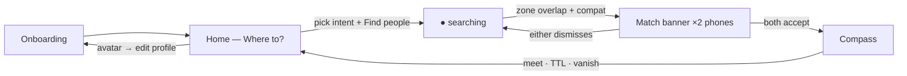
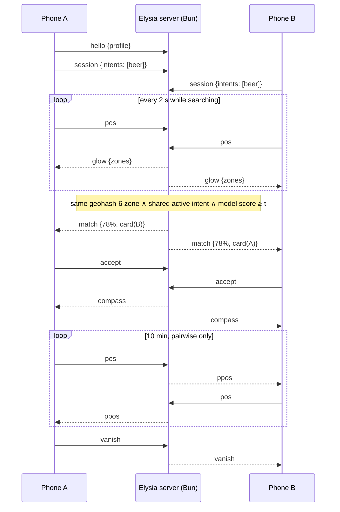

# just-mate — app structure (screens · use cases · flows)

Source of truth for the mobile app. Product rationale lives in `PRODUCT.md`, pitch copy in `DEMO.md`. The session state machine is `PRODUCT.md` §9.

Design north star for Home: **Bolt** — map fullscreen, one bottom sheet, one primary action. Bolt's "pick a destination, see supply heat, order" becomes "pick an intent, see compatible-people heat, start searching".

## Screen map

## Screens

### 1. Onboarding — once

Purpose: build the faceless profile; teach the three rules before the user ever sees a map.

| Step | Content | Rule |
|---|---|---|
| 1 · Interests | chips (min 3): beer · coffee · boardgames · rock · techno · hiking · cinema · books · travel · tech · dogs · climbing · photography · food | feeds the model |
| 2 · Who catches your eye | explain-only in M0: "your attraction profile trains **on your device** — photos never leave your phone; only a compatibility number does" (real training: M1) | no faces |
| 3 · Vibe card preview | the 2-liner others will see — *"quietly funny — will out-argue you about pizza"* — with a reroll button | no chat |

CTA on step 3: **Enter the map**. Edit path later: avatar on Home → same steps pre-filled.

### 2. Home — "Where to?" (the one screen)

Map fullscreen; everything else is state layered on it.

**Layout**

- **Map**: dark base, amber **zone glow** (heatmap circles, size/brightness = density of *compatible* searchers for the active intent). No pins, ever. Zone tap → aggregate only: *"~4 compatible around here"*.
- **Top pill** (status): `invisible` (default) · `● searching: beer`.
- **Bottom sheet — collapsed (idle)**: prompt **"Where to?"** + horizontally scrolling intent chips: **Soul mate · Beer · Coffee · Attractions · Friends · Sports · Music**. Single intent per session (max 2).
- **Bottom sheet — expanded**: intent grid, one-line compat teaser, primary CTA **Find people**.
- **Active (searching)**: sheet collapses to a status card — intent, elapsed time, ghost button **Stop searching**. Zones animate in.

**States**: `idle` (invisible — you see nothing, nothing sees you) → `searching` (matchable, zones visible).

### 3. Match — overlay on Home, arrives on both phones

- `78% · wants: beer` + vibe card in quotes
- **[ Open compass ]** primary · **[ Dismiss ]** ghost · caption *"unlocks only if they accept too"*
- Accept → banner shows *waiting for them…* until mutual → Compass opens. Dismiss → pair cooldown (5 min).
- Arrival vibration `[200,100,200]` + native push (backgrounded).

### 4. Compass — fullscreen

- **Arrow**: `bearing(me→partner) − magnetometer heading`. Partner position is used *only* for this math — never rendered on a map.
- **Distance bucket** (deliberately imprecise): `cold` >200 m · `warm` <200 m · `hot` <80 m · `burning` <30 m — color + haptic escalation.
- **Countdown** 10:00 · **Vanish** always visible (red, kills session for both) · partner's vibe card pinned (the icebreaker).
- States: `waiting-for-signal` · `active` · `expired` · `vanished`.

## Use cases

| # | Use case | Actor · pre | Main flow | Post |
|---|---|---|---|---|
| UC1 | Onboard | first launch | 3 steps → Enter the map | profile stored; invisible |
| UC2 | Start a session | on Home, idle | expand sheet → tap **Beer** → **Find people** | `● searching: beer`, zones visible, matchable |
| UC3 | Read the heat | searching | pan map, tap a zone → aggregate count | nothing revealed beyond counts |
| UC4 | Get matched | both searching, same zone, shared intent, model ≥ τ | banner ×2 → both **Open compass** | compass active, positions relayed pairwise |
| UC5 | Walk to partner | compass active | follow arrow + buckets; haptics escalate | meet → talk → TTL ends session |
| UC6 | Vanish | any session state | tap **Vanish** | session destroyed for both instantly; pair cooldown |
| UC7 | Dismiss a match | banner shown | tap **Dismiss** | banner gone, pair cooldown, still searching |
| UC8 | Switch intent | searching | **Stop searching** → pick new intent → **Find people** | re-enter searching under new intent |
| UC9 | Go invisible | searching | **Stop searching** | idle; unmatchable, zones hidden |
| UC10 | Edit profile | any | avatar → onboarding steps pre-filled | profile updated |
| UC11 | Demo mode (dev) | dev build | hidden toggle | scripted converging positions, identical pipeline |

## Flows

### Session + match (sequence)

### Screen-state summary

| Screen | States | Exits |
|---|---|---|
| Onboarding | step 1–3, edit-mode | Enter the map → Home |
| Home | idle / searching | Find people → searching · banner → Match · avatar → Onboarding |
| Match overlay | offered / waiting-accept | both-accept → Compass · dismiss → Home |
| Compass | waiting-signal / active / expired / vanished | end → Home (cooldown) |

## Message contract (client ↔ Elysia)

| Direction | Message | Payload |
|---|---|---|
| C→S | `hello` | `{id, profile{interests[]}}` |
| C→S | `session` | `{intents: string[]}` — start/replace search |
| C→S | `stop` | — |
| C→S | `pos` | `{lat, lng}` |
| C→S | `accept` / `dismiss` | `{matchId}` |
| C→S | `vanish` | — |
| S→C | `glow` | `{zones: [{gh, lat, lng, n}]}` |
| S→C | `match` | `{matchId, compat, shared[], card[2]}` |
| S→C | `compass` | `{ttl: 600}` |
| S→C | `ppos` | `{lat, lng}` |
| S→C | `vanish` | `{reason}` |

Server truths: positions in-memory per socket only · geohash-6 zones · pair cooldown 5 min · one active session per user · k-anonymity (zones < 3 stay dark) in production.
