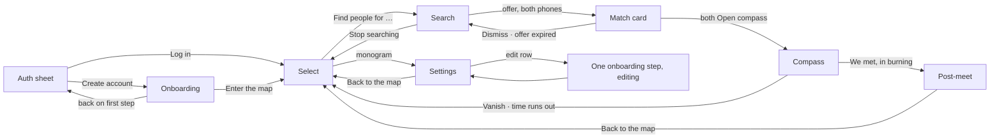
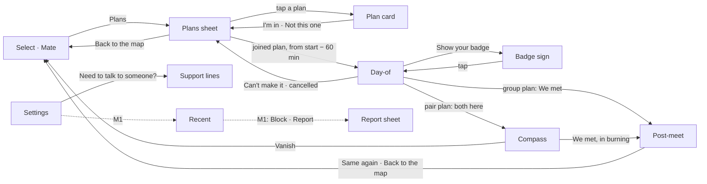
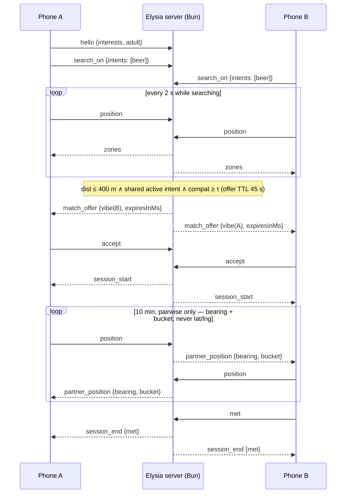

# JustMate — app structure (screens · use cases · flows)

The source of truth for the mobile app's screens, flows, states and copy. It follows the app prototype in the **JustMate Design System** project in Claude Design (https://claude.ai/design/p/c59ab891-429e-48c6-8f77-d899971225cc); where an older note disagrees, the prototype wins. Product rationale lives in `PRODUCT.md`, pitch copy in `DEMO.md`. **Visual, motion and interaction rules (colours, type, materials, springs, haptics, accessibility, the morph surface, the badge) live in `DESIGN.md`**; tokens referenced below in `code` come from there. The wire contract is `PROTOCOL.md`; what the design needs that the wire doesn't carry yet is listed at the end ("Protocol gaps").

Layout north star: **Bolt**. The map is fullscreen, one surface sits on top of it, and there's one primary action. Feel north star: **Apple fluid interfaces**. Press feedback is instant, springs are interruptible, and the chrome over the map is translucent. Bolt's "pick a destination, see supply heat, order" becomes "pick what you're up for, see where compatible people are, find people".

**Added after the mentor review (Sat 3 Oct):** Plans, the help row and the safety screens are in their own section, "Plans, safety and help", just before "Use cases", so the changes stay visible in one place.

## One surface, eight shapes

The app is a single continuous surface over the map that morphs between shapes (`DESIGN.md` §13.1). Screens below are shapes of that surface, not stacked pages.

| Shape | Geometry · tone | What it holds |
|---|---|---|
| `auth` | floating sheet · paper | log in / create account |
| `onboard` | full screen · page | the profile flow |
| `select` | floating sheet · paper | headline, category bento, **Find people for …** |
| `search` | floating sheet · paper | what you're looking for, the clock, **Stop searching** |
| `match` | card from the top · ink | their vibe badge, **Open compass** / **Dismiss** |
| `compass` | full screen · night | countdown, arrow, bucket, **Vanish** / **We met** |
| `postmeet` | full screen · night | both badges, names, opener, **Keep in touch** |
| `settings` | full screen · page | profile, map, feel, privacy, account |

## Screen map

- The app opens on the last persisted shape among `auth`, `onboard`, `select`, `settings`. First launch opens on `auth`.
- **Log in** goes straight to the map. It opens in the mode set in Settings ("Open the map in"), else the profile's mode.
- **Create account** grows the sheet into onboarding with a fresh profile. Back on the first step returns to auth, register tab.
- Onboarding done → select, with the Date / Mate tab set to the profile's mode.

## Modes: Date and Mate

Every profile has a mode, and the map can switch between them at any time.

- **Date** (`heart`, tag "love"): "Someone to fall for, a few streets away."
- **Mate** (`users`, tag "friends"): "People to grab a beer or a game with, right now."

The mode decides the onboarding flow, the interest list, the profile questions, the categories on the map and the pronoun on a match. In date mode the match is "her" when you're interested in women, "his" for men, otherwise "their". In mate mode it's always "their".

## Screens

### 0. Auth (sheet over the map)

Above the sheet, on the map: the wordmark **just-mate**, "Meet for real.", and mono "no faces · no chat · no pins".

- `Segmented`: **Log in** / **Create account**.
- Fields: `email` ("you@example.com") and `password` ("6 characters or more"). The button stays disabled until the email looks valid and the password has 6+ characters.
- Button: **Log in**, or **Create account** with a trailing arrow.
- Under it: ghost **Forgot password** (log in), or the footnote "Next: a faceless profile. Two minutes, no photos of you shown to anyone." (create account).

### 1. Onboarding (full page, once; single steps reopen from Settings)

Purpose: build the faceless profile and teach the three rules before the map.

| Mode | Flow |
|---|---|
| Date | mode → name → interests → questions → who → swipe → verify |
| Mate | mode → name → interests → questions → who → schedule → verify |

Header: ghost back arrow, `StepDots` for the whole flow (mono "editing" when a single step is reopened from Settings). Each step has a mono eyebrow `<group> · n of m`. The groups are `welcome` (mode), `about you` (name, interests, questions), `who you're after` (who, swipe or schedule) and `last step` (verify). Steps slide in 28 pt in the direction of travel.

| Step | Title · sub | Content | CTA |
|---|---|---|---|
| **mode** | "What are you here for?" · "Pick one to start. You can switch on the map any time." | two mode cards: **Date** · **Mate** | **Start with you** → |
| **name** | "What should we call you?" · "First name only. A match sees it once you've met." | field `first name` ("e.g. Alex"); "I am": woman / man / non-binary | **Call me {name}** · disabled "Type your name" |
| **interests** | date "What are you into?" · mate "What do you like doing?" · "Pick at least 3. Each pick opens related ones." | interest chips; each pick reveals 3 related chips (with a loading pill while they arrive) | **That's me** · disabled "Pick {n} more" |
| **questions** | 4 questions, written live from the previous answers | 4 option chips + field "or in your own words" ("say it your way"); see below | **Next question** · last: **Write my vibe** |
| **your badge** | eyebrow "about you · your vibe" · "Designed from your picks. All a match sees." | lanyard vibe badge; caption "Colours from {3 interests}. Pattern from your {n} answers."; tertiary **Reroll** | **Keep this vibe** |
| **who** (date) | "Who are you looking for?" · "Used for matching only. Nobody sees your settings." | interested in: women / men / everyone · age 18–60+ · looking for: something real / see where it goes / something light | **Train my taste** |
| **who** (mate) | "Who's your kind of mate?" · "Matching uses this. It stays on your side." | who: anyone / same gender · group: one-on-one / small group · energy: chill / either / active · age | **Sounds right** |
| **swipe** (date) | "Who catches your eye?" · "Swipe sample photos. Your taste trains on this phone and never leaves it." | 6 sample cards (placeholder "sample photo 01", traits line like "tall · dark hair · beard", mono "n of 6 · on-device only"); stamps "into it" / "not for me"; x and heart buttons with "n / 6"; done card "Taste saved on this phone" · "{n} into it · {m} not for me" | **Verify me** · disabled "{n} left to swipe" |
| **schedule** (mate) | "When are you usually around?" · "Pick any. It helps us time your matches." | weekday mornings · lunch breaks · after work · late nights · weekends; "a hangout usually lasts": an hour / a few hours / all day | **Verify me** · disabled "Pick at least one" |
| **verify** | date "Prove you're real, and 18+" · mate "Prove you're real" · "One selfie, checked once, then deleted. Nobody ever sees it." | ink selfie panel with oval guide and progress ring; status "center your face in the oval" → "hold still…" → "real person · photo deleted". Date adds the check row **"I'm 18 or older"** ("Required for dating. Checked against your selfie."). Footer mono "production path · simulated in this build" | **Take selfie** (loading while scanning) → **Enter the map** (date: only once 18+ is checked) |

**Interests**:

- Date: coffee · wine · cinema · books · travel · cooking · hiking · techno · jazz · art · dogs · yoga · photography · street food.
- Mate: board games · climbing · running · gym · football · padel · gaming · pub quiz · hiking · cycling · concerts · cooking · coding · chess.

Each interest has 3 related ones (coffee → flat white · café hopping · specialty roasters).

**Questions**:

- Eyebrow "about you · question n of 4". The caption (with sparkles) reads "Written from your last answer", "Written from {interest} and {interest}", or "Sample question · live questions off".
- A mono trail "so far a · b · c" collects the answers. While the next question is being written, a thinking line shows "getting a feel for you…" / "reading your answers…".
- Rules for generated questions: sentence case, under 60 characters, 4 options under 26 characters each, lowercase options, no emoji, no exclamation marks, never repeat a topic.
- Fallbacks, date:
  - "Perfect first hour with someone new?" (a long walk, no plan · bar stools and bad jokes · a gallery we pretend to get · cooking something messy)
  - "What makes you lose track of time?" (a good argument · a record shop · people-watching · a project at 2am)
  - "Which small thing wins you over?" (remembering details · laughing at themselves · great taste in music · being on time)
  - "Your friends would call you…" (the planner · the instigator · the calm one · the storyteller)
- Fallbacks, mate:
  - "Nothing planned tonight. What's the move?" (grab a pint · find a pickup game · wander somewhere new · board games till late)
  - "In a group you're usually…" (the one with the plan · the joker · the listener · the competitive one)
  - "What would you teach a new mate?" (a card game · a running route · a recipe · a hidden bar)
  - "Pick a deal-breaker." (always late · no banter · phone at the table · sore loser)

**Vibe line**:

- Rules: two short lowercase clauses joined by " — ", wry and specific, 60 characters at most, no names, emoji or quotes.
- Written from the answers. While it's being written the badge reads "writing…".
- Fallbacks: "quietly funny — will out-argue you about pizza" · "early bird with a film camera — opinions on oat milk" · "knows every climbing gym in town — still scared of ladders" · "techno on fridays — crosswords on sundays" · "plans the trip — forgets the charger".

**The badge**:

- Eyebrow "{name} · wants: {first interest}", the vibe line as the quote, and the mode as the tag.
- Its colours, pattern and icon are designed from your picks and answers (`DESIGN.md` §13.5). It is all a match ever sees of you.

#### Prototype flow in `mobile/src/app/onboarding.tsx`

What the app currently runs on the `onboading` branch, ahead of the design above (LLM interview, local vision model, swipe over generated reference photos):

| Step | Content | Rule |
|---|---|---|
| 1 · What are you up for | intent chips (`soul_mate · date · beer · coffee · friends · sports · music`), any number; below them the required checkbox **"I'm 18 or older"** (blocking: no photos and no verification, so the age gate is explicit — `PRODUCT.md` §10). Used only to tailor step 2 — intents stay per-session (`search_on`) and are never sent in `hello` | 18+ |
| 2 · Interests | chips (min 3) filtered to the interests that fit the intents from step 1 (`mobile/src/lib/interests.ts`); selections that no longer fit are dropped when intents change | feeds the model |
| 3 · Interview | an LLM (local Ollama in M0) asks 10 questions, one at a time, each built on the interests and the previous answers; the answer is a free-text field. After the 10th answer the LLM writes the vibe (5 × "Trait — concrete detail"); the app assembles the profile card in the `docs/examples/profile_card.md` shape, logs it and saves it to `temporary/<id>.md` through the dev-only `POST /dev/profiles` — the vibe is not part of `hello` yet. If the LLM is unreachable, canned questions are used | no chat |
| 4 · A quick photo of you | the front camera takes one photo; a local vision model (`EXPO_PUBLIC_LLM_VISION_MODEL`, Ollama) describes only visible hair and face features (hair, face shape, cheekbones, eyes, facial hair, glasses) — never age, ethnicity, gender, weight, emotion or identity. The result is not shown on screen and is saved in `user.appearance`; the purpose is explained only in the system camera-permission prompt (`CAMERA_COPY` in `mobile/app.config.ts`); the photo itself is used once, held in memory and never stored, uploaded to the server or shown to anyone. **Skip** is allowed | no faces shown |
| 5 · What catches your eye | generated reference photos from `GET /taste` (requested when the step opens), one card at a time: swipe **left = yes**, **right = no**; **Confirm** (enabled once at least one is liked) keeps only the liked photos and enters the map; **Skip** drops every pick. Only the photos of the preferred group are shown — a test constant (`LOOKING_FOR` in `mobile/src/lib/taste.ts`) until the preference is asked in onboarding. The LLM reduces the descriptions of the picked photos to the traits they share, saved as `taste:` in the profile card (`none` when skipped). The taste summary is appended to `user.appearance` as `taste: …` | no faces of users |

CTA on step 3: **Next question**, then **Show photos** on the last one; on step 4 **Enter the map** (`hello`). Edit path later: avatar on Home → same steps pre-filled.

### 2. Select: "What are you up for?" (sheet over the map)

**Map and chrome**

- **Map**: pale greyscale base (`mapBg`) with a faint street grid. Own position is the mint `self` dot, the only dot ever drawn. No heat while you're invisible.
- **Top**: `StatusPill` `invisible` on the left. `Monogram` (your initials, 40) on the right opens Settings.
- **Date / Mate** `Segmented` (`heart` / `users`) floats under the pill. Switching it clears the category and picks.

**The sheet**

- **Headline** rotates every 3.2 s and pauses while a category is open:
  - date: "What are you up for?" · "Where to tonight?" · "What's the plan?" · "Try something new?"
  - mate: "What are you up for?" · "Who's in for something?" · "What's the plan?" · "Go do something."
- **Footnote**: date "Meet someone new over something you'd do anyway." · mate "Find company for something you'd do anyway."
- **Category bento**: six tiles. Tapping one opens it into a dark card with its intents as chips plus **other**, under mono "pick any · {n} selected". Its first intent comes pre-picked; any number can be picked. The other tiles fold into an icon strip. `x` closes the card and clears the picks.
- **Footer**: "You're invisible until you pick something." until a category is open, then the primary **Find people for {picks}** (disabled "Pick at least one").
- **Picks label**: one pick "beer", two "beer or coffee", more "beer, coffee +2". **other** reads "something else".

| Date category | Intents |
|---|---|
| Food and drink | coffee · wine · dinner · brunch · beer · dessert · street food · tea |
| Nightlife | cocktails · dancing · karaoke · late bar · rooftop · comedy night · jazz club |
| Outdoors | walk · picnic · sunset · cycling · riverside · stargazing · park bench |
| Culture | cinema · exhibition · theatre · bookshop · museum · poetry night · street art |
| Music | live gig · jazz bar · record shop · open mic · vinyl bar · concert |
| Attractions | funfair · bowling · escape room · mini golf · arcade · zoo · ferris wheel |

| Mate category | Intents |
|---|---|
| Food and drink | beer · coffee · lunch · street food · pizza · brunch · wine · ramen |
| Sports | running · gym · climbing · football · padel · tennis · basketball · yoga · swim |
| Games | board games · pub quiz · chess · arcade · darts · pool · cards · video games |
| Outdoors | hike · cycling · walk · frisbee · skate · kayak · picnic |
| Music | gig · jam session · record shop · open mic · karaoke · festival |
| Culture | cinema · exhibition · workshop · museum · talk · comedy |

Category icons are in `DESIGN.md` §9.

### 3. Search (sheet over the map)

- **Map**: the **heat field** fades in: a soft density field where compatible people are searching for the same thing, never a pin or a dot per person. Tap a warm zone → badge "~{n} compatible around here" for 2.4 s. Aggregate only.
- **Pill**: `searching: {picks}`, with the pulsing amber dot.
- **Sheet**:
  - a black circle with the intent's icon;
  - mono "● searching · {date|mate} · {category}";
  - "Looking for {picks}" in large title;
  - a row of the category's chips to adjust picks (at least one stays);
  - a card "You're visible nearby" · "Both phones ping at once when it's mutual." with the elapsed clock (m:ss);
  - secondary **Stop searching** (x).
- **Stop searching** → select. Settings › "Stop searching after 30 min" (on by default) does it for you.

### 4. Match (ink card from the top, on both phones at once)

The sheet springs up into an ink card at the top; a scrim dims the map; the status bar hides. Buttons only. There's no swipe-to-dismiss, because an accidental swipe would trigger the pair cooldown.

- Their **lanyard vibe badge** hangs from the top. Eyebrow "{her|his|their} vibe · wants: {intent}", their vibe line as the quote, tag "verified · 18+" (date) or "verified" (mate).
- Mono "match · nearby · on foot" and the offer countdown "0:45", counting down.
- Glow **Open compass** (compass icon) · ghost **Dismiss** · footnote "unlocks only if they accept too". No match percentage is shown.
- After **Open compass**, the button becomes a disabled secondary "waiting for them…" in place, and Dismiss disables. When both have accepted, the card grows into the compass.
- **Dismiss** → back to search; another offer can come later.
- Countdown reaches 0, or they dismiss → the card shows "offer expired" and "you're still searching", then returns to search after 2.4 s. It never says "they declined".
- Arrival: vibration `[200,100,200]` + success haptic on the same frame as the card, on both phones, over the live WebSocket. There's no remote push in M0 (`PRODUCT.md` §8).

### 5. Compass (full screen, night)

- **Countdown** from 10:00 at the top, labelled "left · {intent}". It turns `tempHot` at 1:00, with a warning haptic.
- **Arrow** (`CompassDial`): `bearing(me→partner) − magnetometer heading`. Partner position is used *only* for this math and is never rendered on a map. It re-targets with a critically damped spring on every heading sample, taking the shortest angle with no overshoot. While waiting for signal it dims to 40% and the label reads "finding signal…".
- **Distance bucket** (deliberately imprecise): `cold` over 200 m · `warm` under 200 m · `hot` under 80 m · `burning` under 30 m. Colour + word + haptic escalation (heartbeat 3 s → 1.5 s → 0.7 s). Never colour alone.
- **Vibe card**, compact: "you're looking for" + their line.
- **Vanish** (danger, x): always visible, bottom-left, one tap, no confirmation. It ends the session for both and returns to select.
- **We met** (hand): disabled until the bucket is `burning`, then the glow button → post-meet.
- States: `waiting-for-signal` · `active` · `expired` · `vanished`.

### 6. Post-meet (full screen, night)

- Two small badges side by side: yours with your first name, theirs with theirs.
- Mono "you found each other" (success) · **"Say hi to {name}."** · "Names unlock once you've met. Nothing else does."
- Compact vibe card "an opener, if you need one" with an opener written for the pair ("pineapple. defend your position.").
- Tertiary **Keep in touch** (plus) → loading → check **Kept** once they tap it too. Primary **Back to the map** → select.
- Footnote "Keep in touch unlocks only if they tap it too." → "{name} tapped it too. Saved on this phone."

### 7. Settings (full page, from the monogram)

Back arrow "Back to the map" · large title "Settings".

- **Profile card**: badge swatch, name, mono "{mode} · verified|not verified · no. {serial}", vibe line in italics.

| Group | Rows |
|---|---|
| your profile | Name · Interests ("a, b +n") · Questions and vibe ("{n} answers") · Who you're after (date "{seek} · {min}–{max}", mate "{anyone\|same gender} · {one-on-one\|small group}") · date: Appearance taste ("on this phone") / mate: When you're around |
| the map | Open the map in: Date / Mate · Walk up to: 5 min / 10 min / 15 min · Stop searching after 30 min (switch) |
| feel | Haptics · Sounds · Reduce motion (switches) |
| privacy and safety | Taste and photos ("this phone only") · Blocked people ("0") · Download my data |
| account | Email · Log out |

- Footer: ghost **Delete account** · mono "just-mate · prototype · production path simulated".
- Profile rows reopen their single onboarding step in "editing" mode; done returns to Settings.
- Defaults: haptics on · sounds off · reduce motion off · auto-stop on · walk up to 10 min · open the map in the profile's mode.

## Plans, safety and help (added after the mentor review, Sat 3 Oct)

The mentors asked three things: how JustMate gets a lonely person out of the door, how it protects women from stalkers, and how it pays for itself. The product answer is in `PRODUCT.md` §3.1, §5, §10 and §16. This section lists everything the app gains for it, in one place; the shapes and screens above stay as they are unless a row below says "changed".

Stage tags: **M0** = built for HackYeah · **M1** = production path, design only. In the build, an M1 item is either absent or labelled "production path".

New glyphs (Lucide; add to `DESIGN.md` §9 before use): `calendar-heart` Plans · `map-pin` venue · `repeat` Same again · `id-card` Show your badge · `ellipsis` more · `life-buoy` Need to talk to someone? · `ban` Block · `flag` Report · `history` Recent.

### New and changed shapes

| Shape | Geometry · tone | What it holds | Stage |
|---|---|---|---|
| `select` (changed) | floating sheet · paper | + a **Plans** tile in Mate, next to the category bento | M0 |
| `plans` (new) | floating sheet · paper | up to 3 proposed plans, then **My plans** | M0 |
| `plan` (new) | the sheet grows into one card · paper | activity, venue, time, attendee badges, **I'm in** / **Not this one** | M0 |
| `dayof` (new) | floating sheet · paper | still in?, leave at, status chips, **I'm here**, **Show your badge** | M0 |
| `badgesign` (new) | full screen · ink | your badge, large, to hold up at the venue | M0 |
| `compass` (changed) | full screen · night | also opened from a pair plan; label "{activity} · {venue}" | M0 |
| `postmeet` (changed) | full screen · night | + **Same again next week?**; a group version with everyone who checked in | M0 |
| `settings` (changed) | full screen · page | + help row (M0); + plans and safety rows (M1) | M0 · M1 |
| `report` (new) | floating sheet · paper | block, block and report | M1 |
| `recent` (new) | full screen · page | the last 7 days of matches and plans, as badges | M1 |

### Screen map (additions)

### 8. Plans (sheet over the map, Mate) — M0

**Entry.** In Mate, the select sheet gets one more tile beside the category bento: icon `calendar-heart`, "Plans", sub "Not out yet? Pick a plan for later." Date has no Plans tile in M0 (Date plans are M1: 1:1, verified only, public venues).

**The sheet**

- The pill stays `invisible`: opening Plans makes nobody see you. Your badge appears only on a plan you said I'm in to.
- Large title "Plans near you" · footnote "Say yes to one. It only goes ahead if enough people do."
- Up to 3 **plan rows**: activity icon in a black circle · "{activity}" · "{venue} · {n} min on foot" · "{Thu} {19:00} · ~{60} min" · a row of mini badges + mono "{n} of {size} going".
- **My plans** below, once you've joined one: the same rows with a state chip: `waiting for one more` · `on` · `still in?` · `cancelled`.
- Empty: "No plans near you right now." + secondary **Find people now** (back to the category bento).
- Ghost "Back to the map".

**The plan card** (tap a row; the sheet grows)

- Black circle with the intent's icon · mono "plan · {category}" · large title "{activity}" (e.g. "chess").
- Rows: "{venue}" with "{n} min on foot" — the venue appears on the map as the **only pin** · "{Thu 19:00} · ~{60} min" · "for {size}".
- **Who's going**: their lanyard badges, small, each with its vibe line; mono "{n} of {size} going". Never names, never distance to a person.
- Footnote: "Goes ahead once {min} people are in. If it doesn't, we'll tell you before you leave."
- Primary **I'm in** · ghost **Not this one** (silent; no reason asked).
- After **I'm in**: your badge drops into the row labelled "you" (spring, `DESIGN.md` §13.5); the button becomes disabled "You're in"; tertiary **Can't make it** appears.
- When the plan reaches its minimum: chip `on` + success haptic, on every attendee's phone at the same moment.
- Limit: at 3 open plans, **I'm in** is disabled: "You're in 3 plans. That's plenty."

**Copy rules.** Never "{name} declined" or "{name} left": counts change silently ("3 of 4 going" → "2 of 4 going"). A cancelled plan never says who dropped out.

### 9. Day-of (sheet over the map) — M0

From 60 minutes before the start the joined plan becomes the day-of sheet (M0: when you open the app; M1: push).

- **Still in?** card: "{activity} at {venue} · {19:00}" · primary **Still in** · ghost **Can't make it**. If confirmations fall below the minimum: "Not enough people this time. Here's another one." with one alternative plan row.
- **Leave at {18:52}** in large title · "{9} min on foot" (computed on the phone from your position and the venue) · tertiary **Open in Maps** (hands off to Apple / Google Maps for directions).
- **Status chips**: "on my way" · "5 min late" · "can't make it". Others see the chip as a mono line under your badge. No free text, ever.
- **I'm here**: enabled within ~100 m of the venue (demo mode: always). Then a **spot chip**: "by the window" · "at the bar" · "outside" · "at the door". Others see "here · by the window".
- **Show your badge** → `badgesign`: your badge full-screen on ink, "Hold this up.", screen brightness nudged up; tap anywhere to close.
- **Pair plan**: once both are here, the sheet morphs into the compass (§5) with the label "{activity} · {venue}"; the 10-minute window, buckets, **Vanish** and **We met** work as in §5.
- **Group plan**: primary **We met** once at least two people are here → post-meet.
- **Vanish** (danger, small) leaves the plan at once; the others only see the count drop.

### 10. Post-meet, additions — M0

- **Pair**: as §6, plus tertiary **Same again next week?** (`repeat`) → "waiting for them…" → "Thu 19:00 again. See you there." It creates the same plan for the same two people, +7 days, already `on` in My plans.
- **Group**: the badges of everyone who checked in, in a row with first names: **"Say hi to Sam, Mia and Olek."** One opener for the table. **Keep in touch** per person (tap their badge; mutual as in §6). **Same again next week?** for the whole group: the new plan goes ahead with everyone who taps it, if that's at least the minimum.

### 11. Settings, additions

| Group | Rows | Stage |
|---|---|---|
| help | **Need to talk to someone?** → a page "You don't have to sort it out alone." with the support lines for your country, tap to call. Static list; the app never asks why. | M0 |
| plans | Invite me to plans (switch, off) · footnote "We'll suggest at most one a day, only when you're usually around." | M1 (needs push) |
| privacy and safety | Verified only (switch) · Meeting point first (switch; on by default in Date) · Women-only plans (switch) · Trusted contact · Recent ("last 7 days") · My reports | M1 |

### 12. Block and report — M1

- **Entry points**: their badge on post-meet (`more`), an attendee badge on a plan card (`more`), **Recent**, and a 10-second toast after any Vanish: "Session ended. Report them?" (Vanish itself stays one tap, no confirmation.)
- **Block sheet**: "Block {name | this person}?" · "They won't be matched with you or put in your plans again. They're not told." · danger **Block** · secondary **Block and report**.
- **Report**: reason chips — made me uncomfortable · followed me · didn't take no · fake profile · looks under 18 · other — and an optional field "Anything the safety team should know?" (goes to people who review it, never to them) · **Send report**. Done: "Thanks. They're blocked. We review every report within 24 hours."
- **Recent** (full page): "Recent" · "Last 7 days. Badges only, never places." Rows: their badge · "matched · Tue" or "plan · chess · Thu" · **Block** / **Report**.

### Use cases (additions)

| # | Use case | Actor · pre | Main flow | Post |
|---|---|---|---|---|
| UC15 | Join a plan | Mate, on select | **Plans** → plan card → **I'm in** | your badge on the plan; `waiting for one more` or `on` |
| UC16 | Plan goes ahead | joined plan | attendees reach the minimum | `on` on every attendee's phone at once |
| UC17 | Plan doesn't happen | joined plan | not filled by start − 60 min, or confirmations drop below the minimum | everyone told before leaving; one alternative offered |
| UC18 | Confirm | start − 60 min | **Still in** / **Can't make it** | confirmed, or left silently |
| UC19 | Arrive | plan `on` | leave at → walk → **I'm here** + spot chip | others see "here · {spot}" |
| UC20 | Find each other | at the venue | pair: compass (UC6) · group: **Show your badge** | **We met** → post-meet |
| UC21 | Same again | post-meet | everyone taps **Same again next week?** | the same plan, same people, +7 days |
| UC22 | Get help | any | Settings → **Need to talk to someone?** | local support lines, tap to call |
| UC23 | Block or report (M1) | post-meet, plan, Recent, after Vanish | **Block** / **Block and report** | never matched or grouped again; report reviewed |
| UC24 | Demo time skip (dev) | dev build | hidden toggle: the demo plan starts now | still in?, leave at and I'm here reachable on stage |

### Screen-state summary (additions)

| Shape | States | Exits |
|---|---|---|
| plans | empty / proposals / proposals + my plans | tap a row → plan · Back to the map → select |
| plan | open / joined: waiting · on / full / cancelled | I'm in, Not this one, Can't make it → plans |
| dayof | still in? / leave at / on my way / here | pair, both here → compass · group, We met → postmeet · Can't make it, cancelled → plans |
| badgesign | — | tap → dayof |
| postmeet | + same again: idle / waiting / again | Back to the map → select |
| report (M1) | block / reasons / sent | done → the shape it came from |
| recent (M1) | — | row → report · back → settings |

### Protocol gaps (Plans)

Protocol first: these go into `PROTOCOL.md` and `@justmate/protocol` before a screen relies on them. A suggested shape, not a decision:

- **P1 · Plan list.** `plans_get` over the socket, answered with up to 3 `Plan {id, intent, category, venue {id, name, lat, lng}, startsAt, durationMin, size, min, attendees: Badge[], state}`. The server uses the `position` the client sent just before, in memory only — never as URL query parameters, which end up in logs. Venue coordinates are the only coordinates a client receives.
- **P2 · Join and leave.** `plan_join {planId}` / `plan_leave {planId}`; leaving is silent to the others.
- **P3 · Live updates.** `plan_update {plan}` to every attendee when the count or the state changes (`waiting | on | cancelled | dissolved`), so `on` lands on all phones at once.
- **P4 · Still in.** `plan_confirm {planId}` from start − 60 min; the server cancels below the minimum and sends one alternative.
- **P5 · Status and arrival.** `plan_status {planId, status: on_my_way | late | cant_make_it | here, spot?: window | bar | outside | door}`; the server checks `here` against the venue (≤ ~100 m), demo mode exempt.
- **P6 · Pair compass from a plan.** When both attendees of a pair plan are `here`, `session_start` carries `planId`; the rest is the existing compass flow (`partner_position`, `met`, `vanish`).
- **P7 · Group met.** `met {planId}` → `session_end {met}` to everyone who checked in, with first names (gap 6 in "Protocol gaps" below).
- **P8 · Same again.** `again {planId}`; when everyone who checked in has tapped it (or at least the minimum, for groups), `plan_update` delivers the new plan (+7 days).
- **P9 · Mode.** Plans are Mate-only in M0, so they depend on gap 1 in "Protocol gaps" below (mode on the wire).
- **P10 · Venues.** A seeded server-side list of ~15 public venues in Kraków with intents and opening hours; no client endpoint beyond what `Plan.venue` carries.
- **P11 · Demo time skip.** Dev-only: a demo plan whose `startsAt` is now + 2 min, plus a toggle that jumps to the start.
- **P12 · M1.** Block, report and Recent endpoints (opaque ids, 7 days, no positions), verified flags, push for invites and reminders.

## Use cases

| # | Use case | Actor · pre | Main flow | Post |
|---|---|---|---|---|
| UC1 | Create account | first launch | auth → **Create account** → onboarding (7 steps for your mode) → **Enter the map** | profile + badge stored; invisible on select |
| UC2 | Log in | returning | auth → **Log in** | select, in your start mode |
| UC3 | Start a search | on select, invisible | (switch Date / Mate) → tap a category → pick intents → **Find people for …** | `searching: {picks}`, heat visible, matchable |
| UC4 | Read the heat | searching | tap a warm zone | "~n compatible around here", nothing beyond counts |
| UC5 | Get matched | both searching, within walking range, a shared intent, compatible | ink card ×2 → both **Open compass** | compass active, positions relayed pairwise |
| UC6 | Walk to them | compass active | follow arrow + buckets; haptics escalate | **We met** in `burning` → post-meet |
| UC7 | Keep in touch | post-meet | both tap **Keep in touch** | "Kept", saved on this phone |
| UC8 | Vanish | compass | tap **Vanish** | session destroyed for both instantly; pair cooldown; select |
| UC9 | Dismiss a match | match card shown | tap **Dismiss** | back to search; pair cooldown; still searching |
| UC10 | Let an offer expire | match card shown | 45 s pass, or they dismiss | "offer expired" · "you're still searching" → search |
| UC11 | Change what you're looking for | searching | adjust chips in the search sheet, or **Stop searching** → pick again | searching under the new picks |
| UC12 | Go invisible | searching | **Stop searching** (or 30 min auto-stop) | select; unmatchable, heat hidden |
| UC13 | Edit profile | any | monogram → Settings → a row → that step, editing | profile updated |
| UC14 | Demo mode (dev) | dev build | hidden toggle | scripted converging positions, identical pipeline |

## Flows

### Session + match (sequence, current wire)

The diagram uses today's `PROTOCOL.md` messages. Fields the design adds are in "Protocol gaps".

### Screen-state summary

| Shape | States | Exits |
|---|---|---|
| auth | log in / create account | Log in → select · Create account → onboard |
| onboard | one step of 7, or a single step "editing" | Enter the map → select · back on step 1 → auth · editing done → settings |
| select | no category / category open | Find people → search · monogram → settings |
| search | searching (clock running) | offer → match · Stop searching / auto-stop → select |
| match | offered / accepted ("waiting for them…") / expired | both accepted → compass · Dismiss / expired → search |
| compass | waiting-for-signal / active / expired / vanished | We met → postmeet · Vanish / time up → select |
| postmeet | keep in touch: idle / waiting / kept | Back to the map → select |
| settings | — | Back to the map → select · row → onboard (editing) |

## Message contract (client ↔ Elysia)

**The contract is `docs/PROTOCOL.md`: one source of truth, don't duplicate it here.** Quick map of shapes to today's events:

| Shape / action | Events |
|---|---|
| Onboarding → Enter the map | `hello {interests, adult: true}` → `ready {userId, vibe, config}` |
| Select → **Find people for …** / search → **Stop searching** | `search_on {intents}` / `search_off` |
| Search | `position` every 2 s → `zones` every 2 s |
| Match card | `match_offer` → `accept` \| `dismiss` → `session_start` \| `offer_expired` |
| Compass | `position` every 1 s → `partner_position {bearing, bucket}` (never lat/lng) → `session_end {met\|expired\|vanished\|disconnected}` |
| Vanish / We met | `vanish {sessionId}` / `met {sessionId}` |

Server truths (today): positions in-memory per socket only · match gate = distance ≤ 400 m + shared active intent (zones are display only) · offer TTL 45 s · session TTL 10 min · pair cooldown 5 min · one active offer/session per user · ghosts never match · k-anonymity (zones < 3 stay dark) in production.

## Protocol gaps

What the design needs that `PROTOCOL.md` / `@justmate/protocol` don't carry yet. Each one goes protocol-first (doc, then package, then code) before the screen relies on it.

1. **Mode.** Date / Mate isn't on the wire. `hello` has no profile mode, and `search_on` has no session mode. Matching has to stay inside one mode.
2. **Category + multi-pick intents.** `search_on.intents` takes 1–2 words from `soul_mate · date · beer · coffee · friends · sports · music`. The design sends a category (6 per mode) and any number of its intents, plus "other". The vocabulary, the 2-pick cap and `isIntent` all need replacing. `match_offer.sharedIntent` must name one of the new intents.
3. **Interest vocabulary.** `INTERESTS` differs from the design's two per-mode lists, and doesn't cover the related interests that picks unlock (open-ended).
4. **Profile fields.**
   - `hello` carries only interests, nickname and adult.
   - The design adds first name, gender, question answers, and the vibe line chosen in onboarding.
   - Date also adds seek, age range, looking for and appearance taste (on-device score only).
   - Mate also adds who, group, energy, age range, the "when you're around" slots and hangout length.
   - And for both: verified.
5. **Vibe line + badge.** `ready.vibe` / `match_offer.vibe` are written by the server from both profiles. The design shows the partner's **own** vibe line (rerolled and kept in onboarding), their top interests (badge colours, tags), a badge seed and verified / 18+ tags. Post-meet needs an **opener** for the pair.
6. **Names after meeting.** "Say hi to {name}" needs the partner's first name, and only after `met`, e.g. on `session_end{met}`.
7. **Keep in touch.** No message exists. It needs a mutual opt-in after `met` (`keep` → both → `kept`) and a decision on what is saved on the phone.
8. **Offer countdown.** The design counts 45 s down from "0:45". That matches `config.offerTtlMs` (45000) and `match_offer.expiresInMs`. The client must render from `expiresInMs`, not a hard-coded 45.
9. **Match percentage.** `match_offer.matchPct` is still sent but the design no longer renders it. Keep it dev-only or drop it.
10. **Walk-up distance + auto-stop.** Settings › "Walk up to 5 / 10 / 15 min" implies a per-user match radius. Today the wire has one global `matchRadiusM` (400 m ≈ 5 min). Auto-stop after 30 min is client-side, but the server could enforce it too.
11. **18+ in mate mode.** `hello` requires `adult: true` for everyone (close code `4001`). The design asks for the 18+ check only in date mode. Decide whether mate users are also 18+ (safest, and today's server rule) or the gate becomes per mode.
12. **Verification.** The selfie check is "production path · simulated in this build". A `verified` flag needs a source of truth before it is shown on badges.
13. **Auth.** The design shows email + password ("6 characters or more", "Forgot password"). The server ships Better Auth magic links. This isn't WebSocket protocol, but the auth sheet and the server must agree.
14. **Account actions.** Blocked people, Download my data and Delete account have no endpoints yet.
