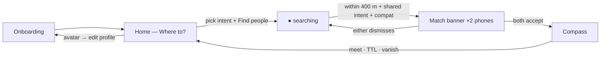
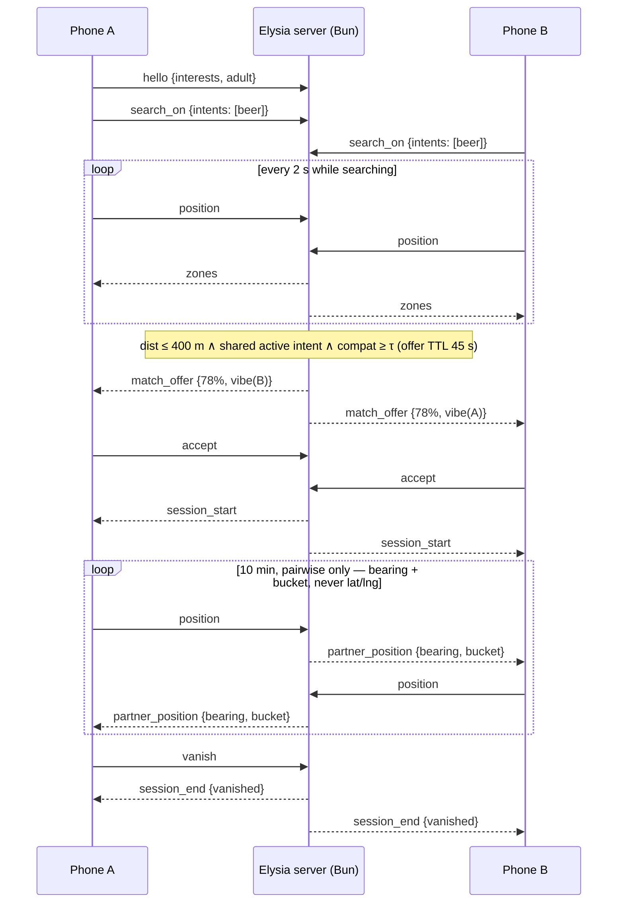

# JustMate — app structure (screens · use cases · flows)

Source of truth for the mobile app. Product rationale lives in `PRODUCT.md`, pitch copy in `DEMO.md`. The session state machine is `PRODUCT.md` §9. **Visual, motion and interaction rules (colors, type, materials, springs, haptics, accessibility) live in `DESIGN.md`** — tokens referenced below in `code` come from there.

Layout north star for Home: **Bolt** — map fullscreen, one bottom sheet, one primary action. Feel north star for everything: **Apple fluid interfaces** (see `DESIGN.md`) — instant press feedback, interruptible springs, translucent chrome over the map. Bolt's "pick a destination, see supply heat, order" becomes "pick an intent, see compatible-people heat, start searching".

## Screen map

## Screens

### 1. Onboarding — once

Purpose: build the faceless profile; teach the three rules before the user ever sees a map.

| Step | Content | Rule |
|---|---|---|
| 1 · What are you up for | intent chips (`soul_mate · date · beer · coffee · friends · sports · music`), any number; below them the required checkbox **"I'm 18 or older"** (blocking: no photos and no verification, so the age gate is explicit — `PRODUCT.md` §10). Used only to tailor step 2 — intents stay per-session (`search_on`) and are never sent in `hello` | 18+ |
| 2 · Interests | chips (min 3) filtered to the interests that fit the intents from step 1 (`mobile/src/lib/interests.ts`); selections that no longer fit are dropped when intents change | feeds the model |
| 3 · Interview | an LLM (local Ollama in M0) asks 10 questions, one at a time, each built on the interests and the previous answers; the answer is a free-text field. After the 10th answer the LLM writes the vibe (5 × "Trait — concrete detail"); the app assembles the profile card in the `docs/examples/profile_card.md` shape, logs it and saves it to `temporary/<id>.md` through the dev-only `POST /dev/profiles` — the vibe is not part of `hello` yet. If the LLM is unreachable, canned questions are used | no chat |
| 4 · A quick photo of you | the front camera takes one photo; a local vision model (`EXPO_PUBLIC_LLM_VISION_MODEL`, Ollama) describes only visible hair and face features (hair, face shape, cheekbones, eyes, facial hair, glasses) — never age, ethnicity, gender, weight, emotion or identity. The result is not shown on screen and is saved in `user.appearance`; the purpose is explained only in the system camera-permission prompt (`CAMERA_COPY` in `mobile/app.config.ts`); the photo itself is used once, held in memory and never stored, uploaded to the server or shown to anyone. **Skip** is allowed | no faces shown |
| 5 · What catches your eye | generated reference photos from `GET /taste` (requested when the step opens), one card at a time: swipe **left = yes**, **right = no**; **Confirm** (enabled once at least one is liked) keeps only the liked photos and enters the map; **Skip** drops every pick. Only the photos of the preferred group are shown — a test constant (`LOOKING_FOR` in `mobile/src/lib/taste.ts`) until the preference is asked in onboarding. The LLM reduces the descriptions of the picked photos to the traits they share, saved as `taste:` in the profile card (`none` when skipped). The taste summary is appended to `user.appearance` as `taste: …` | no faces of users |

CTA on step 3: **Next question**, then **Show photos** on the last one; on step 4 **Enter the map** (`hello`). Edit path later: avatar on Home → same steps pre-filled.

### 2. Home — "Where to?" (the one screen)

Map fullscreen; everything else is state layered on it.

**Layout**

- **Map**: dark desaturated base (`mapBase`), amber **zone glow** (`glow` → `glowCore` for dense zones; heatmap circles, size/brightness = density of *compatible* searchers for the active intent). Glow grows/shrinks from its centre once per update — no idle breathing. No pins, ever. Zone tap → aggregate only: *"~4 compatible around here"*.
- **Top pill** (status, thin translucent material): `invisible` (default) · `● searching: beer`. Own avatar (monogram, no photo) top-right → edit profile.
- **Bottom sheet** (thick translucent material, map scrolls under; chips/buttons on it are solid; 1:1 drag, momentum-projected snap, rubber-band past the top — `DESIGN.md` §6.4).
- **Bottom sheet — collapsed (idle)**: prompt **"Where to?"** + horizontally scrolling intent chips: **Soul mate · Date · Beer · Coffee · Friends · Sports · Music** ("Date" = a casual first meet; "Soul mate" = looking for a relationship — never "Attractions", which reads as sightseeing). Single intent per session (max 2).
- **Bottom sheet — expanded**: intent grid, one-line compat teaser, primary CTA **Find people**.
- **Active (searching)**: sheet collapses to a status card — intent, elapsed time, ghost button **Stop searching**. Zones animate in.

**States**: `idle` (invisible — you see nothing, nothing sees you) → `searching` (matchable, zones visible).

### 3. Match — overlay on Home, arrives on both phones

Solid card + dim scrim over the map, enters from the top like a system notification and leaves the same way. Buttons only — no swipe-to-dismiss (an accidental swipe would trigger the pair cooldown).

- `78% · wants: beer` + vibe card in quotes
- **[ Open compass ]** primary · **[ Dismiss ]** ghost · caption *"unlocks only if they accept too"*
- Accept → the button morphs in place into *waiting for them…* until mutual → Compass expands from the button. Dismiss → pair cooldown (5 min).
- Arrival vibration `[200,100,200]` + success haptic on the same frame as the banner (both phones), delivered over the live WebSocket — no remote push in M0 (see `PRODUCT.md` §8).

### 4. Compass — fullscreen

- **Arrow**: `bearing(me→partner) − magnetometer heading`. Partner position is used *only* for this math — never rendered on a map.
- **Arrow** re-targets with a critically damped spring on every heading sample (shortest-angle path, no overshoot wobble); dims to 40% in `waiting-for-signal`.
- **Distance bucket** (deliberately imprecise): `cold` >200 m (`tempCold` blue) · `warm` <200 m (`tempWarm` amber) · `hot` <80 m (`tempHot` orange) · `burning` <30 m (`tempBurning` white-hot) — color + label + haptic escalation (heartbeat 3 s → 1.5 s → 0.7 s). Never color alone.
- **Countdown** 10:00 in tabular figures (warning haptic + `tempHot` at 1:00) · **Vanish** always visible (`danger` red — the only red in the app; one tap, no confirmation, kills session for both) · partner's vibe card pinned (the icebreaker).
- Opaque background — no map, no translucency; the walk is the only thing on screen.
- States: `waiting-for-signal` · `active` · `expired` · `vanished`.

## Use cases

| # | Use case | Actor · pre | Main flow | Post |
|---|---|---|---|---|
| UC1 | Onboard | first launch | 3 steps → Enter the map | profile stored; invisible |
| UC2 | Start a session | on Home, idle | expand sheet → tap **Beer** → **Find people** | `● searching: beer`, zones visible, matchable |
| UC3 | Read the heat | searching | pan map, tap a zone → aggregate count | nothing revealed beyond counts |
| UC4 | Get matched | both searching, ≤ 400 m apart, shared intent, model ≥ τ | banner ×2 → both **Open compass** | compass active, positions relayed pairwise |
| UC5 | Walk to partner | compass active | follow arrow + buckets; haptics escalate | meet → talk → TTL ends session |
| UC6 | Vanish | any session state | tap **Vanish** | session destroyed for both instantly; pair cooldown |
| UC7 | Dismiss a match | banner shown | tap **Dismiss** | banner gone, pair cooldown, still searching |
| UC8 | Switch intent | searching | **Stop searching** → pick new intent → **Find people** | re-enter searching under new intent |
| UC9 | Go invisible | searching | **Stop searching** | idle; unmatchable, zones hidden |
| UC10 | Edit profile | any | avatar → onboarding steps pre-filled | profile updated |
| UC11 | Demo mode (dev) | dev build | hidden toggle | scripted converging positions, identical pipeline |

## Flows

### Session + match (sequence)

### Screen-state summary

| Screen | States | Exits |
|---|---|---|
| Onboarding | step 1–3, edit-mode | Enter the map → Home |
| Home | idle / searching | Find people → searching · banner → Match · avatar → Onboarding |
| Match overlay | offered / waiting-accept | both-accept → Compass · dismiss → Home |
| Compass | waiting-signal / active / expired / vanished | end → Home (cooldown) |

## Message contract (client ↔ Elysia)

**The contract is `docs/PROTOCOL.md` — one source of truth, do not duplicate it here.** Quick map of screens to events:

| Screen / action | Events |
|---|---|
| Onboarding → Enter the map | `hello {interests, adult: true}` → `ready {userId, vibe, config}` |
| Home → **Find people** / **Stop searching** | `search_on {intents}` / `search_off` |
| Searching | `position` every 2 s → `zones` every 2 s |
| Match overlay | `match_offer` → `accept` \| `dismiss` → `session_start` \| `offer_expired` |
| Compass | `position` every 1 s → `partner_position {bearing, bucket}` (never lat/lng) → `session_end {met\|expired\|vanished\|disconnected}` |
| Vanish / we met | `vanish {sessionId}` / `met {sessionId}` |

Server truths: positions in-memory per socket only · match gate = distance ≤ 400 m + shared active intent (zones are display only) · offer TTL 45 s · session TTL 10 min · pair cooldown 5 min · one active offer/session per user · ghosts never match · k-anonymity (zones < 3 stay dark) in production.
